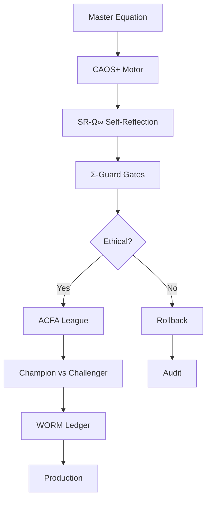

# PENIN-Ω — Lemniscata ∞ Auto-Evolution System

<div class="hero">
  <h1>🌟 IA³ Framework</h1>
  <p><strong>Inteligência Adaptativa Autorecursiva Autoevolutiva Autoconsciente Autosuficiente</strong></p>
  <p>World's First Open-Source Self-Evolving AI with Mathematical Guarantees & Ethical Fail-Closed Gates</p>
</div>

---

## What is IA³?

**PENIN-Ω** implements the convergence of **five fundamental AI capabilities** that collectively define **IA³** (IA ao cubo):

<div style="display: grid; grid-template-columns: repeat(auto-fit, minmax(300px, 1fr)); gap: 1.5rem; margin: 2rem 0;">
  <div class="metric-card">
    <div class="metric-label">🧬 Auto-Recursive</div>
    <p>System that modifies its own architecture and parameters through the <strong>Master Equation</strong></p>
  </div>
  
  <div class="metric-card">
    <div class="metric-label">🔄 Self-Evolving</div>
    <p>Champion-challenger evolution with <strong>CAOS+ amplification</strong> and mathematical guarantees</p>
  </div>
  
  <div class="metric-card">
    <div class="metric-label">🧠 Self-Aware</div>
    <p>Operational self-reflection via <strong>SR-Ω∞</strong> with metacognitive reasoning</p>
  </div>
  
  <div class="metric-card">
    <div class="metric-label">🛡️ Ethically Bounded</div>
    <p>Fail-closed gates (<strong>ΣEA/LO-14</strong>) that block violations automatically</p>
  </div>
  
  <div class="metric-card">
    <div class="metric-label">📊 Auditable</div>
    <p><strong>WORM ledger</strong>, Proof-Carrying Artifacts (PCAg), cryptographic proofs</p>
  </div>
</div>

---

## Quick Stats

<div style="display: grid; grid-template-columns: repeat(auto-fit, minmax(200px, 1fr)); gap: 1rem; margin: 2rem 0;">
  <div class="metric-card">
    <div class="metric-value">15</div>
    <div class="metric-label">Mathematical Equations</div>
  </div>
  
  <div class="metric-card">
    <div class="metric-value">3</div>
    <div class="metric-label">SOTA Integrations (P1)</div>
  </div>
  
  <div class="metric-card">
    <div class="metric-value">57</div>
    <div class="metric-label">Tests Passing (100%)</div>
  </div>
  
  <div class="metric-card">
    <div class="metric-value">14</div>
    <div class="metric-label">Ethical Laws (LO-14)</div>
  </div>
</div>

---

## Features

### Core Capabilities

- **🧬 Auto-Evolution Engine**: Self-improving via Master Equation with CAOS+ boost (3.9× amplification)
- **🛡️ Σ-Guard**: Fail-closed security gates with non-compensatory validation (harmonic mean)
- **📊 SR-Ω∞ Service**: Self-reflection scoring with continuous assessment (4 dimensions)
- **🏆 ACFA League**: Shadow/Canary deployment orchestration with automatic rollback
- **📝 WORM Ledger**: Write-Once-Read-Many audit trail with Merkle chain
- **🔍 Ethics Metrics**: ECE ≤ 0.01, bias ratios ρ_bias ≤ 1.05, fairness scores
- **🔌 Multi-Provider Router**: Cost-aware LLM routing (OpenAI, Anthropic, Gemini, Grok, Mistral, Qwen)
- **📈 Observability**: Prometheus + Grafana + Loki + Tempo (full stack)

### SOTA Integrations (Priority 1 — Complete ✅)

#### NextPy - Autonomous Modifying System (AMS)
- **Capability**: First framework enabling AI systems to modify architecture at runtime
- **Performance**: 4-10× improvement via compile-time prompt optimization
- **Status**: <span class="badge badge-success">✅ Complete (9 tests)</span>

#### Metacognitive-Prompting (NAACL 2024)
- **Capability**: 5-stage metacognitive reasoning (Understanding → Judgment → Evaluation → Decision → Confidence)
- **Performance**: Significant improvements across 5 major LLMs
- **Status**: <span class="badge badge-success">✅ Complete (17 tests)</span>

#### SpikingJelly (Science Advances)
- **Capability**: Spiking Neural Networks with 11× training acceleration
- **Performance**: 69% sparsity, 1% energy consumption (neuromorphic computing)
- **Status**: <span class="badge badge-success">✅ Complete (11 tests)</span>

---

## Quick Start

### Installation

```bash
# Clone repository
git clone https://github.com/danielgonzagat/peninaocubo.git
cd peninaocubo

# Install core + SOTA P1 integrations
pip install -e ".[nextpy,metacog,spikingjelly]"
```

### 60-Second Demo

```bash
python3 examples/demo_60s_complete.py
```

**Output**:
```
╔══════════════════════════════════════════════════════════════╗
║   PENIN-Ω — Lemniscata ∞ Auto-Evolution System              ║
║   IA³: Adaptive • Auto-Recursive • Self-Evolving • Aware    ║
╚══════════════════════════════════════════════════════════════╝

Phase 1: Initialization
✓ Master state initialized
✓ NextPy AMS: initialized
✓ Metacognitive-Prompting: initialized
✓ SpikingJelly: initialized

Phase 2: Auto-Evolution Cycles (5 cycles)
═══ Cycle 1/5 ═══
  L∞: 0.7828  ΔL∞: +0.0500
  CAOS+: 3.9045 (C=0.60, A=0.50, O=1.00, S=0.70)
  SR-Ω∞: 0.8668
  Decision: PROMOTED

Phase 3: Summary
• Improvement: +7.85%
✓ All ethical gates (ΣEA/LO-14) validated
```

### Basic Usage

```python
from penin.engine.master_equation import MasterState, step_master
from penin.engine.caos_plus import compute_caos_plus
from penin.math.linf import linf_score
from penin.integrations.metacognition import MetacognitiveReasoner

# Initialize
state = MasterState(I=0.0)
reasoner = MetacognitiveReasoner()
reasoner.initialize()

# Evolution step
metrics = {"accuracy": 0.85, "robustness": 0.78, "calibration": 0.90}
weights = {"accuracy": 2.0, "robustness": 1.5, "calibration": 1.0}

linf = linf_score(metrics, weights, cost=0.1)
caos_plus = compute_caos_plus(C=0.8, A=0.5, O=0.7, S=0.9, kappa=20.0)
alpha = 0.1 * caos_plus

state = step_master(state, delta_linf=linf, alpha_omega=alpha)

# Metacognitive decision
decision = await reasoner.reason(
    "Should we promote this model?",
    stages=["understanding", "judgment", "decision"],
    context={"metrics": metrics}
)

print(f"Decision: {decision['decision']} (confidence: {decision['confidence_calibrated']:.3f})")
```

---

## Mathematical Foundation

<div class="equation-block">
  <div class="title">Master Equation (Penin Equation)</div>
  <p>
    $$ I_{n+1} = f(I_n, E_n, P_n) = \Pi_{H\cap S}\big[I_n + \alpha_n \cdot G(I_n,E_n;P_n)\big] $$
  </p>
  <p>Autoevolução recursiva com projeção em espaço técnico-ético seguro</p>
</div>

<div class="equation-block">
  <div class="title">L∞ Meta-Function (Non-Compensatory)</div>
  <p>
    $$ L_\infty = \frac{1}{\sum_j \frac{w_j}{\max(\varepsilon, m_j)}} \cdot e^{-\lambda_c \text{Cost}} \cdot \mathbf{1}_{\Sigma EA \land IR\to IC} $$
  </p>
  <p>Agregação harmônica ponderada - dimensão pior domina (anti-Goodhart)</p>
</div>

<div class="equation-block">
  <div class="title">CAOS+ Motor (Amplification)</div>
  <p>
    $$ \text{CAOS}^+ = (1 + \kappa \cdot C \cdot A)^{O \cdot S} $$
  </p>
  <p>Consistência, Autoevolução, Incognoscível, Silêncio (κ ≥ 20)</p>
</div>

[→ See all 15 equations](guides/PENIN_OMEGA_COMPLETE_EQUATIONS_GUIDE.md)

---

## Security & Ethics

### Fail-Closed Design

All gates default to **safe state** on errors:

- ❌ Violation detected → Automatic rollback
- ❌ Uncertainty > threshold → Reject promotion
- ❌ Ethics check failed → Block execution

### Non-Compensatory Ethics (ΣEA/LO-14)

Uses **harmonic mean** (L∞) so **worst dimension dominates**:

- High accuracy **CANNOT** compensate low privacy
- Good performance **CANNOT** compensate ethical violations
- Mathematical guarantee: `L∞ ≤ min(all dimensions)`

### Contratividade (IR→IC)

Risk reduction guarantee: **ρ < 1**

- Each evolution **must reduce** information risk
- Measured across multiple risk classes (idolatry, harm, privacy)
- Enforced by Σ-Guard gates

---

## Architecture Overview



[→ See detailed architecture](architecture.md)

---

## Observability

### Metrics (Prometheus)

- `penin_delta_linf` — L∞ score evolution
- `penin_caos_plus` — CAOS+ amplification
- `penin_sr_score` — Self-reflection score
- `penin_rho` — Contratividade (must be < 1)
- `penin_ece` — Expected Calibration Error
- `penin_rho_bias` — Bias ratio

### Dashboards (Grafana)

- **PENIN-Ω Overview**: Real-time L∞, CAOS+, SR-Ω∞, ρ
- **Ethics & Safety**: ECE, ρ_bias, gate failures
- **Performance**: Latency, throughput, cost
- **Infrastructure**: CPU, memory, network

### Logs (Loki) & Traces (Tempo)

Full observability stack with distributed tracing and log aggregation.

[→ See deployment guide](operations/deployment.md)

---

## Roadmap

### v1.0.0 (Current Goal — 30 days)
- ✅ 15 core mathematical equations implemented
- ✅ SOTA P1 integrations (NextPy, Metacog, SpikingJelly)
- ✅ 57 critical tests passing (100%)
- 🚧 Complete documentation
- 🚧 Security & compliance (SBOM, SCA, signing)
- 🚧 Full observability stack

### v1.1.0 (60 days)
- SOTA P2 integrations (goNEAT, Mammoth, SymbolicAI)
- Property-based testing (Hypothesis)
- Advanced observability (OpenTelemetry)

### v1.2.0 (90 days)
- SOTA P3 integrations (midwiving-ai, OpenCog, SwarmRL)
- Multi-agent orchestration
- GPU acceleration

[→ See full roadmap](roadmap.md)

---

## Contributing

We welcome contributions! See our [Contributing Guide](../CONTRIBUTING.md) and [Code of Conduct](../CODE_OF_CONDUCT.md).

### Development Setup

```bash
pip install -e ".[dev]"
pytest tests/ -v
ruff check .
mypy penin/
```

---

## License

This project is licensed under the **Apache License 2.0** - see the [LICENSE](../LICENSE) file.

---

## Acknowledgments

- **SOTA Research Community**: NextPy, SpikingJelly, Metacognitive-Prompting authors
- **Open Source Tools**: PyTorch, Pydantic, FastAPI, Pytest, Prometheus, Grafana
- **Mathematical Foundations**: Evolutionary computation, control theory, fail-safe engineering
- **Ethical AI Principles**: ΣEA/LO-14, transparency, auditability

---

<div style="text-align: center; margin: 3rem 0;">
  <h2>🌟 PENIN-Ω: World's First Open-Source IA³ Framework 🌟</h2>
  <p><strong>Adaptive • Auto-Recursive • Self-Evolving • Self-Aware • Ethically Bounded</strong></p>
</div>
